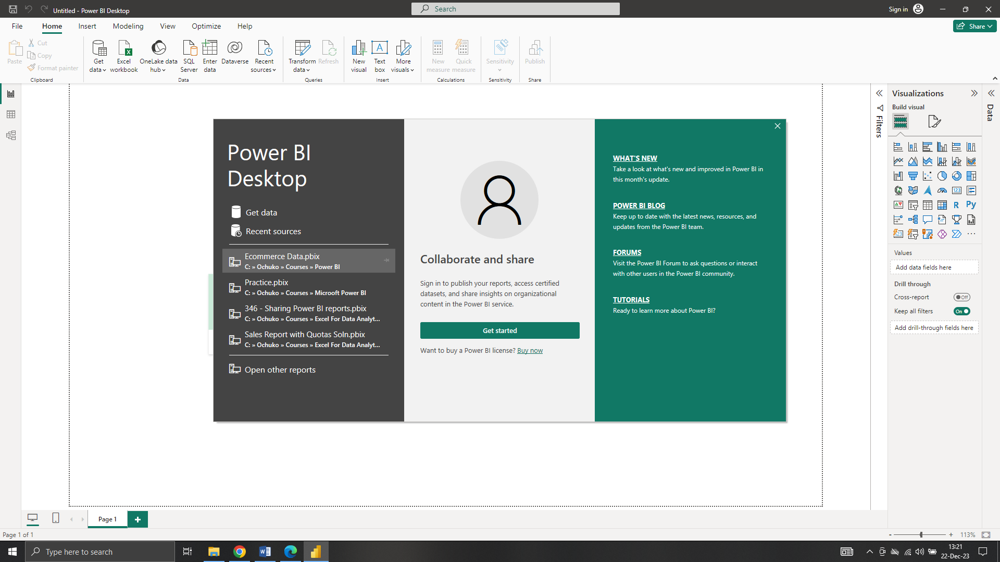
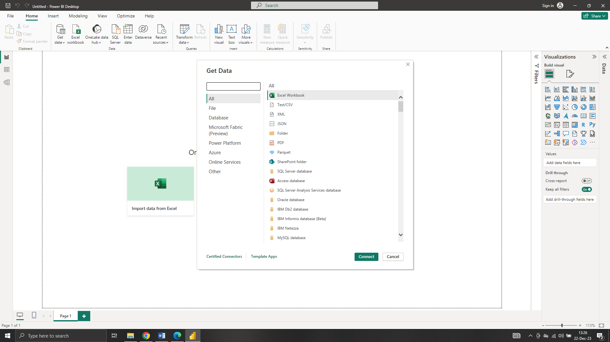
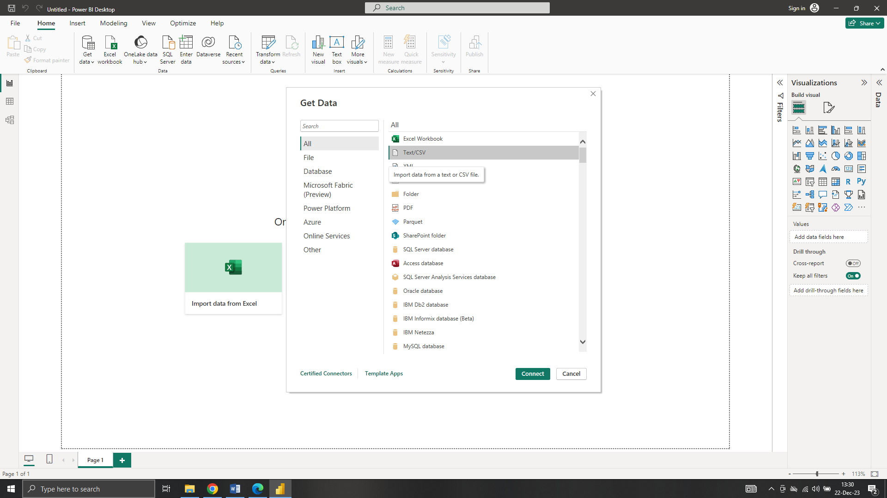
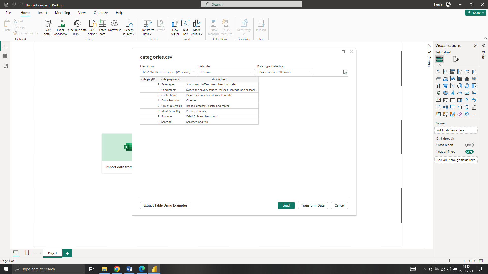
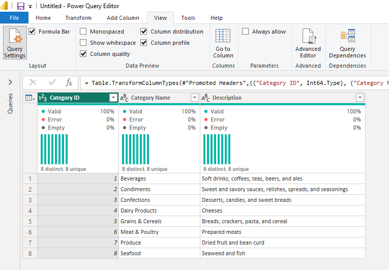
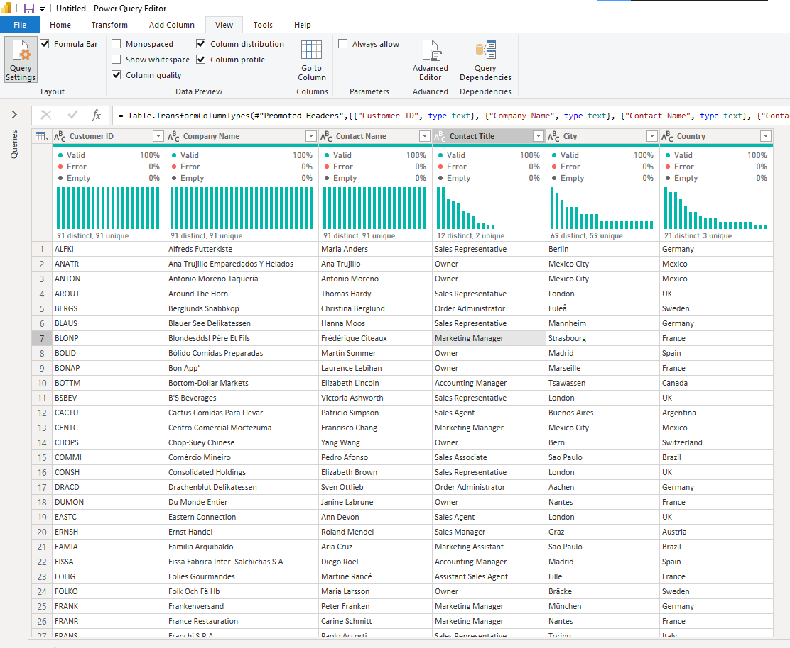
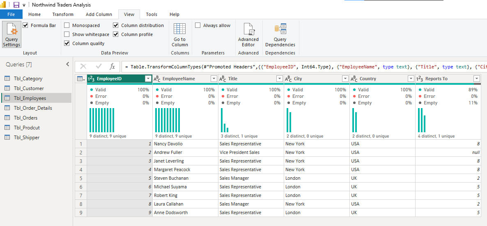
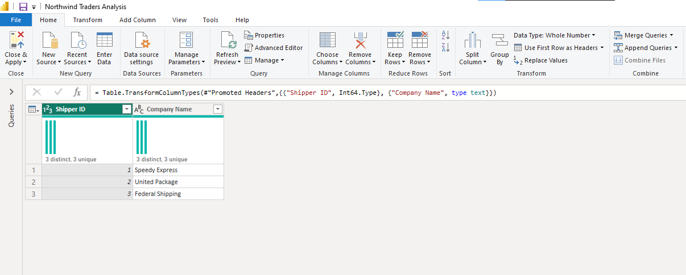

# NORTHWIND TRADERS SALES ANALYSIS
A Power BI project that involves examining sales and order data for Northwind Traders, a gourmet food supplier, simplifying complex information to facilitate strategic decision-making.

## Project Overview
This project aims to provide Northwind Traders, a fictitious gourmet food supplier with actionable insights, derived from the analysis of sales and order data using Power BI. By understanding historical sales trends, product performance, key customer relationships, and shipping cost consistency, the company can make informed decisions to optimize its business strategies, improve operational efficiency, and enhance overall performance in the gourmet food supply market. 

The project will provide Northwind Traders with the tools and knowledge needed for strategic planning and ongoing success.

## Project Scope
This project covers sales data from July 4, 2013 to May 6, 2015, focusing on customer relationship, product performance, sales trends, and shipping cost consistency. 

## Business Objective
The objective for this analysis is to identify if there are any noticeable sales trends over time, to find out the best and the worst selling product by identifying high performing and under perming product, identifying key customer, and to find out if shipping cost are consistent across providers. 

## Document Purpose
This documentation serves as a guide for project stakeholders, providing insights into the project's objectives, data sources, data analysis, visualizations, and any other relevant information. 

## Use Case
This analysis project for Northwind Traders would provide valuable insights and improvements across various operational aspects. Different stakeholders within the organization could leverage these findings to enhance their respective functions. 
Here are key stakeholders who could make use of this analysis and benefit from it.

**1. Operations Managers:**
-	Use of Analysis: Operations managers can leverage insights to streamline order fulfillment processes, optimize inventory levels, and improve overall efficiency in day-to-day operations.
-	Benefits: Reduced operational costs, enhanced productivity, and improved order fulfillment times

**2. Marketing Team:**
- Use of Analysis: The marketing team can benefit from insights into customer preferences, satisfaction levels, and overall market trends.
- Benefits: More targeted marketing strategies, improved customer engagement, and increased sales.

**3. Customer Service and Sales Teams:**
-	Use of Analysis: Customer service and sales teams can benefit from improved communication channels, real-time order tracking, and a better understanding of customer preferences and issues.
-	Benefits: Enhanced customer satisfaction, increased sales, and improved customer retention

## Skills Demostrated
- Data Connection in Power BI
- Data Profilling
- Data Cleaning and Transformation in Power Query
- Data Modelling
- Data Analysis
- Data Visualization

## Data Source

The project utilizes a dataset containing information on sales and order. The dataset used for this analysis was downloaded from Maven Analytics website where datasets are available for practice purpose. The dataset is a CSV file and it consist seven main tables which are category table, customer table, employees table, order table, order details table, products tables and shippers table

Category table contain information about product category. It has eight rows, and three columns which are Category ID, Category Name, and Description. Category Id is the unique identifier for each product category, Category Name is the name of the category while Description column describe the category and its products.

Customer table contain information about customer. It has ninety-one (91) rows, and five (5) columns which are Customer ID, Company Name, Contact Name, Contact Title, City, and country. Customer Id is the unique identifier for each customer, Company Name is the name of the customer's company, Contact Name is the name of the primary contact for the customer, Contact Title is the job title of the primary contact for the customer, City is the city where the customer is located, and Country is the country where the customer is located.

Employees table contain information about employees. It has nine (9) rows, and six (6) columns which are Employee ID, Employee Name, Title, City, Country and Reports To. Employee ID is the unique identifier for each employee, Employee Name is the full name of the employee, Title is the employee's job title, City is where the employee works, Country is where the employee works and Report To is the ID of the employee's manager.

Order table contain information on each order placed from July 4, 2013 to May 6, 2015. It has eight hundred and thirty (830) rows, and eight (8) column which are Order ID, Customer ID, Employee ID, Order Date, Required Date, Shipped Date, Shipper ID and Freight. Order ID is the unique identifier for each order, Customer ID is the customer who placed the order, Employee ID is the employee who processed the order, Order Date is the date when the order was placed, Required Date is the date when the customer requested the order to be delivered, Shipped Date is the date when the order was shipped, Shipper ID is the ID of the shipping company used for the order, and Freight is the shipping cost for the order (USD). 

Order details table contain others information about the other placed. It has two thousand, one hundred and fifty-five (2,155) rows, and five (5) columns which are Order ID, Product ID, Unit Price, Quantity, and Discount. Order ID is the ID of the order in which this other information belongs to, Product ID is the ID of the product that being ordered, Unit Price is the price per unit of the product at the time the order was placed (USD - discount not included), Quantity is the number of units being ordered and Discount is the discount percentage applied to the price per unit. 

Product table contains information about product. It has seventy-seven (77) rows, and six (6) columns which are Product ID, Product Name, Quantity Per Unit, Unit Price, Discontinued, and Category ID. Product ID is the unique identifier for each product, Product Name is the name of the product, Quantity Per Unit is the quantity of the product per package, Unit Price is the current price per unit of the product (USD), Discontinued column provide information about product that has been discontinued. It Indicates with a 1 if the product has been discontinued, and Category ID is the ID of the category the product belongs to.

Shipper table contains information about shippers. It has three (3) rows, and two (2) columns which are Shipper ID and Company Name. Shipper ID is the unique identifier for each shipper, and Company Name is the name of the company that provides shipping services. 

## Data Connection Details

In Power BI, connecting to a CSV file involves specifying the location of the CSV file and defining the data import settings. Here are the steps taken in data connection in Power BI. 

**1. Open Power BI Desktop**

- Launched Power BI Desktop on computer

**2. Get Data**

- Clicked on the "Home" tab in the Power BI Desktop.
- Selected "Get Data" to initiate the data import process.

**3. Choose Text/CSV and Specify the File Location**

- In the "Get Data" window, selected "Text/CSV" as the data source.
- Navigated to the location where the CSV file is stored.
- Selected the CSV file I want to import and clicked "Open."

**4. Preview and Transform:**
- Power BI displayed a preview of the data from the CSV file.
- Reviewed the data to ensure it is displayed correctly.

## Data Profiling

Data profiling in Power BI helps to examining and analyzing the characteristics and quality of data to gain insights into its structure, patterns, potential issues, and identify outliers. It helps to make informed decision on data cleaning and transformation. Power BI provides several tools and features that helps to profile data effectively. These are column quality, column distribution and column profile.

**Data Profile on Key Column on Category Table**

**1. Basic Information**

- Table Name: Category Table
- Number of Rows: Eight
- Number of Key Columns: Two 

**2. Column Profile**

|Column Name|Data Type|Distinct Value|Unique Value|% Valid Values|% Error Values|% Empty Values|Min|Max|
|----------------|---------|--------------|------------|-------------|------------|-------------|---|---|
|Category ID|Whole Number|8|8|100|0|0|1|8|
|Category Name|Text|8|8|100|0|0|Beverages|Seafood|

**3. Data Quality Checks**

**Missing Values:**

- Category ID: 0
- Category Name: 0
- Duplicates: This table has no duplicate value

**Data Profile on Key Column on Customer Table**

**1. Basic Information** 
- Table Name: Customer Table
- Number of Rows: Ninety-one
- Number of Key Columns: Five

**2. Column Profile**

|Column Name|Data Type|Distinct Value|Unique Value|% Valid Values|% Error Values|% Empty Values|Min|Max|
|----------------|---------|--------------|------------|-------------|------------|-------------|---|---|
|Customer ID|Text|91|91|100|0|0|ALFKI|WOLZA|
|Company Name|Text|91|91|100|0|0|Alfreds Futterkiste|Wolski Zajazd|
|Contact Name|Test|91|91|100|0|0|Alejandra Camino|Zbyszek Piestrzeniewicz|
|Contact Title|Text|12|2|100|0|0|Accounting Manager|Sales Representative|
|Country|Text|23|3|100|0|0|Argentina|Venezuela|

**3. Data Quality Checks**

**Missing Values:**
- Customer ID: 0
- Company Name: 0
- Contact Name: 0
- Contact Title: 0
- Country: 0
- Duplicates: This table has no duplicate value

**Data Profile on Key Column on Employee Table**

**1. Basic Information**

- Table Name: Employee Table
- Number of Rows: Nine
- Number of Key Columns: Two

**2. Column Profile**

|Column Name|Data Type|Distinct Value|Unique Value|% Valid Values|% Error Values|% Empty Values|Min|Max|
|----------------|---------|--------------|------------|-------------|------------|-------------|---|---|
|Employee ID|Whole Number|9|9|100|0|0|1|9|
|Employee Name|Text|9|9|100|0|0|Andrew Fuller|Steven Buchanan|

**3. Data Quality Checks**

**Missing Values:**
- Employee ID: 0
- Employee Name: 0
- Duplicates: This table has no duplicate value

**Data Profile on Key Column on Shippers Table**

**1. Basic Information** 

- Table Name: Shippers Table
- Number of Rows: Three
- Number of Key Columns: Two
  
**2. Column Profile**

|Column Name|Data Type|Distinct Value|Unique Value|% Valid Values|% Error Values|% Empty Values|Min|Max|
|----------------|---------|--------------|------------|-------------|------------|-------------|---|---|

