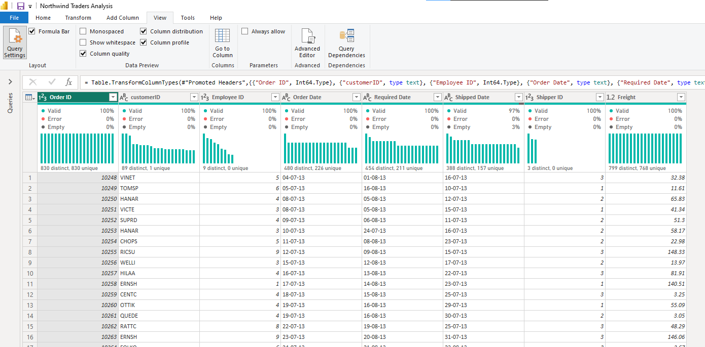
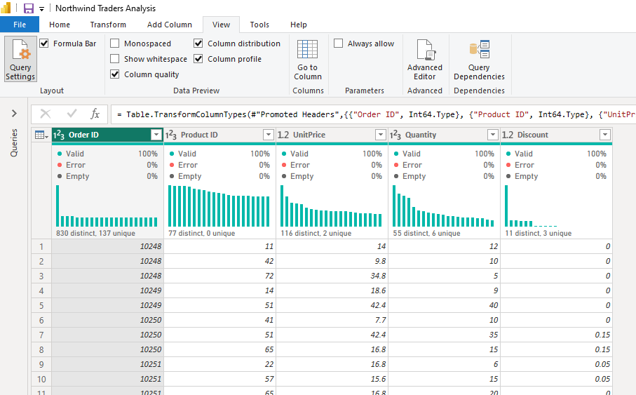
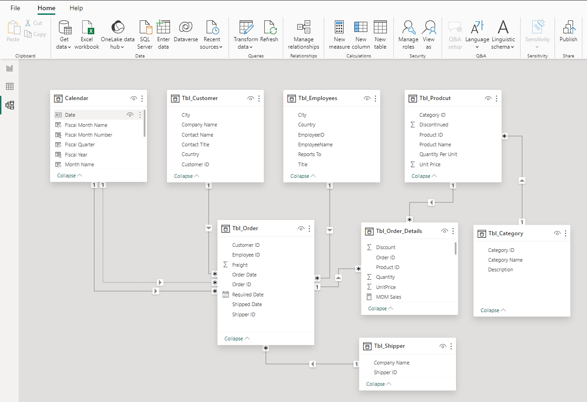

# NORTHWIND TRADERS SALES ANALYSIS
A Power BI project that involves examining sales and order data for Northwind Traders, a gourmet food supplier, simplifying complex information to facilitate strategic decision-making.

## Project Overview
This project aims to provide Northwind Traders, a fictitious gourmet food supplier with actionable insights, derived from the analysis of sales and order data using Power BI. By understanding historical sales trends, product performance, key customer relationships, and shipping cost consistency, the company can make informed decisions to optimize its business strategies, improve operational efficiency, and enhance overall performance in the gourmet food supply market. 

The project will provide Northwind Traders with the tools and knowledge needed for strategic planning and ongoing success.

## Project Scope
This project covers sales data from July 4, 2013 to May 6, 2015, focusing on customer relationship, product performance, sales trends, and shipping cost consistency. 

## Business Objective
The objective for this analysis is to identify if there are any noticeable sales trends over time, to find out the best and the worst selling product by identifying high performing and under perming product, identifying key customer, and to find out if shipping cost are consistent across providers. 

## Document Purpose
This documentation serves as a guide for project stakeholders, providing insights into the project's objectives, data sources, data analysis, visualizations, and any other relevant information. 

## Use Case
This analysis project for Northwind Traders would provide valuable insights and improvements across various operational aspects. Different stakeholders within the organization could leverage these findings to enhance their respective functions. 
Here are key stakeholders who could make use of this analysis and benefit from it.

**1. Operations Managers:**
-	Use of Analysis: Operations managers can leverage insights to streamline order fulfillment processes, optimize inventory levels, and improve overall efficiency in day-to-day operations.
-	Benefits: Reduced operational costs, enhanced productivity, and improved order fulfillment times

**2. Marketing Team:**
- Use of Analysis: The marketing team can benefit from insights into customer preferences, satisfaction levels, and overall market trends.
- Benefits: More targeted marketing strategies, improved customer engagement, and increased sales.

**3. Customer Service and Sales Teams:**
-	Use of Analysis: Customer service and sales teams can benefit from improved communication channels, real-time order tracking, and a better understanding of customer preferences and issues.
-	Benefits: Enhanced customer satisfaction, increased sales, and improved customer retention

## Skills Demostrated
- Data Connection in Power BI
- Data Profilling
- Data Cleaning and Transformation in Power Query
- Data Modelling
- Data Analysis
- Data Visualization

## Data Source

The project utilizes a dataset containing information on sales and order. The dataset used for this analysis was downloaded from Maven Analytics website where datasets are available for practice purpose. The dataset is a CSV file and it consist seven main tables which are category table, customer table, employees table, order table, order details table, products tables and shippers table

Category table contain information about product category. It has eight rows, and three columns which are Category ID, Category Name, and Description. Category Id is the unique identifier for each product category, Category Name is the name of the category while Description column describe the category and its products.

Customer table contain information about customer. It has ninety-one (91) rows, and five (5) columns which are Customer ID, Company Name, Contact Name, Contact Title, City, and country. Customer Id is the unique identifier for each customer, Company Name is the name of the customer's company, Contact Name is the name of the primary contact for the customer, Contact Title is the job title of the primary contact for the customer, City is the city where the customer is located, and Country is the country where the customer is located.

Employees table contain information about employees. It has nine (9) rows, and six (6) columns which are Employee ID, Employee Name, Title, City, Country and Reports To. Employee ID is the unique identifier for each employee, Employee Name is the full name of the employee, Title is the employee's job title, City is where the employee works, Country is where the employee works and Report To is the ID of the employee's manager.

Order table contain information on each order placed from July 4, 2013 to May 6, 2015. It has eight hundred and thirty (830) rows, and eight (8) column which are Order ID, Customer ID, Employee ID, Order Date, Required Date, Shipped Date, Shipper ID and Freight. Order ID is the unique identifier for each order, Customer ID is the customer who placed the order, Employee ID is the employee who processed the order, Order Date is the date when the order was placed, Required Date is the date when the customer requested the order to be delivered, Shipped Date is the date when the order was shipped, Shipper ID is the ID of the shipping company used for the order, and Freight is the shipping cost for the order (USD). 

Order details table contain others information about the other placed. It has two thousand, one hundred and fifty-five (2,155) rows, and five (5) columns which are Order ID, Product ID, Unit Price, Quantity, and Discount. Order ID is the ID of the order in which this other information belongs to, Product ID is the ID of the product that being ordered, Unit Price is the price per unit of the product at the time the order was placed (USD - discount not included), Quantity is the number of units being ordered and Discount is the discount percentage applied to the price per unit. 

Product table contains information about product. It has seventy-seven (77) rows, and six (6) columns which are Product ID, Product Name, Quantity Per Unit, Unit Price, Discontinued, and Category ID. Product ID is the unique identifier for each product, Product Name is the name of the product, Quantity Per Unit is the quantity of the product per package, Unit Price is the current price per unit of the product (USD), Discontinued column provide information about product that has been discontinued. It Indicates with a 1 if the product has been discontinued, and Category ID is the ID of the category the product belongs to.

Shipper table contains information about shippers. It has three (3) rows, and two (2) columns which are Shipper ID and Company Name. Shipper ID is the unique identifier for each shipper, and Company Name is the name of the company that provides shipping services. 

## Data Connection Details

In Power BI, connecting to a CSV file involves specifying the location of the CSV file and defining the data import settings. Here are the steps taken in data connection in Power BI. 

**1. Open Power BI Desktop**

- Launched Power BI Desktop on computer


**2. Get Data**

- Clicked on the "Home" tab in the Power BI Desktop.
- Selected "Get Data" to initiate the data import process.


**3. Choose Text/CSV and Specify the File Location**

- In the "Get Data" window, selected "Text/CSV" as the data source.
- Navigated to the location where the CSV file is stored.
- Selected the CSV file I want to import and clicked "Open."


**4. Preview and Transform:**
- Power BI displayed a preview of the data from the CSV file.
- Reviewed the data to ensure it is displayed correctly.


## Data Profiling

Data profiling in Power BI helps to examining and analyzing the characteristics and quality of data to gain insights into its structure, patterns, potential issues, and identify outliers. It helps to make informed decision on data cleaning and transformation. Power BI provides several tools and features that helps to profile data effectively. These are column quality, column distribution and column profile.

**Data Profile on Key Column on Category Table**


**1. Basic Information**

- Table Name: Category Table
- Number of Rows: Eight
- Number of Key Columns: Two 

**2. Column Profile**

|Column Name|Data Type|Distinct Value|Unique Value|% Valid Values|% Error Values|% Empty Values|Min|Max|
|----------------|---------|--------------|------------|-------------|------------|-------------|---|---|
|Category ID|Whole Number|8|8|100|0|0|1|8|
|Category Name|Text|8|8|100|0|0|Beverages|Seafood|

**3. Data Quality Checks**

**Missing Values:**

- Category ID: 0
- Category Name: 0
- Duplicates: This table has no duplicate value

**Data Profile on Key Column on Customer Table**


**1. Basic Information** 
- Table Name: Customer Table
- Number of Rows: Ninety-one
- Number of Key Columns: Five

**2. Column Profile**

|Column Name|Data Type|Distinct Value|Unique Value|% Valid Values|% Error Values|% Empty Values|Min|Max|
|----------------|---------|--------------|------------|-------------|------------|-------------|---|---|
|Customer ID|Text|91|91|100|0|0|ALFKI|WOLZA|
|Company Name|Text|91|91|100|0|0|Alfreds Futterkiste|Wolski Zajazd|
|Contact Name|Test|91|91|100|0|0|Alejandra Camino|Zbyszek Piestrzeniewicz|
|Contact Title|Text|12|2|100|0|0|Accounting Manager|Sales Representative|
|Country|Text|23|3|100|0|0|Argentina|Venezuela|

**3. Data Quality Checks**

**Missing Values:**
- Customer ID: 0
- Company Name: 0
- Contact Name: 0
- Contact Title: 0
- Country: 0
- Duplicates: This table has no duplicate value

**Data Profile on Key Column on Employee Table**


**1. Basic Information**

- Table Name: Employee Table
- Number of Rows: Nine
- Number of Key Columns: Two

**2. Column Profile**

|Column Name|Data Type|Distinct Value|Unique Value|% Valid Values|% Error Values|% Empty Values|Min|Max|
|----------------|---------|--------------|------------|-------------|------------|-------------|---|---|
|Employee ID|Whole Number|9|9|100|0|0|1|9|
|Employee Name|Text|9|9|100|0|0|Andrew Fuller|Steven Buchanan|

**3. Data Quality Checks**

**Missing Values:**
- Employee ID: 0
- Employee Name: 0
- Duplicates: This table has no duplicate value

**Data Profile on Key Column on Shippers Table**


**1. Basic Information** 

- Table Name: Shippers Table
- Number of Rows: Three
- Number of Key Columns: Two
  
**2. Column Profile**

|Column Name|Data Type|Distinct Value|Unique Value|% Valid Values|% Error Values|% Empty Values|Min|Max|
|----------------|---------|--------------|------------|-------------|------------|-------------|---|---|
|Shipper ID|Whole Number|3|3|100|0|0|1|3|
|Company Name|Text|3|3|100|0|0|Company Name|United Package|

**3. Data Quality Checks**

**Missing Values:**

- Shipper ID: 0
- Company Name: 0
- Duplicates: This table has no duplicate value

**Data Profile on Key Column on Product Table**


**1. Basic Information**

- Table Name: Product Table
- Number of Rows: Seventy-Seven
- Number of Key Columns: Four

**2. Column Profile**

|Column Name|Data Type|Distinct Value|Unique Value|% Valid Values|% Error Values|% Empty Values|Min|Max|
|----------------|---------|--------------|------------|-------------|------------|-------------|---|---|
|Product ID|Whole Number|77|77|100|0|0|1|77|
|Product Name|Text|77|77|100|0|0|Zaanse koeken|Alice Mutton|
|Unit Price|Decimal Number|62|52|100|0|0|2.5|263.5|
|Category ID|Whole Number|8|0|100|0|0|1|8|

**3. Data Quality Checks**

**Missing Values:**

- Product ID: 0
- Product Name: 0
- Unit Price: 0
- Category ID: 0
- Duplicates: This table has no duplicate value

**Data Profile on Key Column on Order Table**


**1. Basic Information**

- Table Name: Order Table
- Number of Rows: Eight Hundred and Thirty
- Number of Key Columns: Seven

**2. Column Profile**

|Column Name|Data Type|Distinct Value|Unique Value|% Valid Values|% Error Values|% Empty Values|Min|Max|
|----------------|---------|--------------|------------|-------------|------------|-------------|---|---|
|Order ID|Whole Number|830|830|100|0|0|10248|11077|
|Customer ID|Text|89|77|100|0|0|ALFKI|WOLZA|
|Employee ID|Whole Number|9|0|100|0|0|1|9|
|Order Date|Date|480|226|100|0|0|04-Jul-13|08-Aug-14|
|Shipped Date|Date|388|157|97|0|3|10-Jul-13|06-May-15|
|Shipper ID|Whole Number|3|0|100|0|0|1|3|
|Freight|Decimal Number|799|768|100|0|0|0.02|1007.64

**3. Data Quality Checks**

**Missing Values:**
- Order ID: 0
- Customer ID: 0
- Employee ID: 0
- Order Date: 0
- Shipped Date: 21 (This indicate the orders made that are not yet shipped)
- Shipper ID: 0
- Freight: 0
- Duplicates: This table has no duplicate value

**Data Profile on Key Column on Order Detail Table**


**1. Basic Information**

- Table Name: Order Details Table
- Number of Rows: Two Thousand, One Hundred and Fifty-five
- Number of Key Columns: Five

**2. Column Profile**

|Column Name|Data Type|Distinct Value|Unique Value|% Valid Values|% Error Values|% Empty Values|Min|Max|
|----------------|---------|--------------|------------|-------------|------------|-------------|---|---|
|Order ID|Whole Number|830|137|100|0|0|10248|11077|
|Product ID|Whole Number|77|0|100|0|0|1|77|
|Unit Price|Decimal Number|116|2|100|0|0|2|263.5|
|Quantity|Whole Number|55|6|100|0|0|1|130|
|Discount|Decimal Number|11|3|100|0|0|0|0.25|

**3. Data Quality Checks**

**Missing Values:**

- Order ID: 0
- Product ID: 0
- Unit Price: 0
- Quantity: 0
- Discount: 0
- Duplicates: This table has no duplicate value

## Data Cleaning and Processes.

In Power BI, data cleaning is performed using the Power Query Editor, a powerful tool that helps to shape and manipulate data before it gets loaded into the Power BI data model. Data cleaning helps to achieve high data integrity, data quality, maintain data consistency, and accuracy. 

Based on the insight generated from data profiling, dataset for this analysis is well-structured, consistent, and free from significant issues that could hinder analysis or interpretation. The data follows a standardized format and adheres to consistent naming conventions. All necessary data fields are present and populated, the data values are accurate, data types are appropriately assigned to each column, and has no duplicate records. Therefore, no further cleaning is required.

The following process was carried out during data processes.

- Added a new table

Northwind Traders Food Supplier runs a fiscal year that starts on July 2013 and end 12 months later. Therefore, adding a calendar table is important in this analysis. A calendar table is a table with unique date value, often referred to as a date dimension or time table. 


This table was marked as date table. Marking a calendar table as a date table in Power BI enhance time-based calculations, navigation, and interactions within Power BI reports. When a calendar table is marked as date table, it’s like telling Power BI that the table contains date-related information, allowing the system to optimize certain functionalities such as Time Intelligence Functions. Marking a calendar table enables the use of time intelligence functions in DAX (Data Analysis Expressions). Functions like TOTALYTD, TOTALQTD, TOTALMTD, and others work more effectively when applied to a designated date table. These functions help with year-to-date, quarter-to-date, and month-to-date calculations.

Calendar table contain nine columns which are Date, Month Name, Month Number, Quarter, Year, Fiscal Month Number, Fiscal Month Name, Fiscal Year, and Fiscal Quarter. Incorporating a calendar table into Power BI model helps to create a custom fiscal calendar, aligning with the organization's financial reporting periods. It helps to perform time intelligence functions that work seamlessly with a well-structured calendar table. These functions also help to perform various time-based calculations, such as year-to-date and month-to-month comparisons. A calendar table also help to create a date hierarchy, providing a natural and intuitive way to drill down into data. Users can easily navigate from year to month, enhancing the overall user experience.

## Data Modelling

Data modeling in Power BI involves structuring and organizing data to create meaningful relationships between different tables. A well-designed data model is essential for building accurate and insightful reports


Established an active and inactive relationships between tables using common fields (keys), examined the relationships diagram to ensure that relationships between tables are correctly defined and accurately represents the connections between tables. An active relationship is the default relationship between tables that Power BI uses for filtering and calculations. When relationship is being created between two tables, Power BI assumes it's an active relationship unless it has been specified otherwise. Active relationships are used for most calculations and visualizations. An inactive relationship is an additional relationship between tables that is not used by default for filtering or calculations. Inactive relationships helped to have multiple relationships between tables without causing conflicts. Inactive relationships are useful to create more complex models, such as scenarios involving different date relationships. It helps to analysis data base on different perspectives. In this analysis, established Inactive relationship between Calendar table (Date Column) and Order table (Shipped Date Column). This helped to use different date relationships in different contexts. When creating measures or calculations, USERELATIONSHIP function was used to explicitly reference the inactive relationship. 

Reviewed cardinality (e.g., one-to-many) and cross-filtering settings for each relationship. Cardinality defined the nature of relationship that exist between tables, it explains how one table relates to the other. This helped to ensure accurate and meaningful results in reports. Cross-filtering direction refers to the direction in which filter flows between two related tables. Properly set cross-filter direction for creating effective relationships data model and ensured that reports accurately reflect the intended relationships between tables.

## Data Analysis and Insight

The objective of this analysis is to understand sales trends, identify best and worst selling products, recognize key customers, and assess shipping cost consistency by analyzing the sales and order data of Northwind Traders. 

**NOTE:** In the course of this analysis, encompassing fiscal years 2014 and 2015, the current set of results reflects the specific outcomes derived when the slicer was configured to the fiscal year 2015, providing a focused view on the corresponding data and insights within that particular timeframe.

**This analysis provides answers to the following questions.**

**1. Are there noticeable sales trend in overtime?**

This refers to the examination of sales and order data to identify patterns, tendencies, or recurring behaviors in the context of time. It involves analyzing how sales performance changes and evolves over a specific period. To identify noticeable sales trends over time, typically performed time series analysis on the sales and order data. This type of analysis is valuable for understanding patterns, trends, and behaviors within the data over time.

In Power BI, a comprehensive approach was taken to identify significant sales trends over time by creating a measure that calculates the total sales. 

_DAX code for calculating Total Sales_

```Total Sales = SUMX (Tbl_Order_Details, Tbl_Order_Details[Quantity]* Tbl_Order_Details[UnitPrice])```

This measure was then utilized in conjunction with visualization tool, line chart.

Line chart graphically represent and analyze the evolving patterns and fluctuations in sales data, thereby providing a clearer and more insightful understanding of the temporal dynamics within the dataset.


- From this analysis, there is a general increasing trend in revenue from July to March, indicating a positive sales trajectory and strong performance during this period. This trend suggests successful sales strategies, customer engagement, or market demand during these months.
- May stands out with a significant drop in revenue. There may be external factors affecting sales in May, such as seasonal changes, economic conditions, or specific market events. 
- June reports zero revenue, indicating a potential issue or anomaly. Operational challenges, data entry error or system issues may be contributing to the absence of sales data in June.

After the initial analysis, I dug deeper to figure out which months had higher or lower revenue compared to the previous month. This detailed exploration helped to understand the patterns in revenue changes over time. The results of this analysis are neatly shown in a waterfall chart, making it easy to see and grasp the factors influencing revenue fluctuations from month to month.

Waterfall chart graphically represent and analyze sales data to show percentage increase in sales compared to the previous month. A waterfall chart is beneficial for visualizing the month-to-month changes in revenue in a sequential manner. Each column in the waterfall chart represents a month, and the vertical movement between columns represents the percentage change in revenue. The chart effectively highlights positive and negative contributions to revenue changes. Positive values would be represented by columns going upwards, while negative values would be represented by columns going downwards. 

A comprehensive approach was taken to create a measure that calculate percentage increase in sales compared to the previous month.

1. _DAX code for calculating Total Sales_

```Total Sales = SUMX (Tbl_Order_Details, Tbl_Order_Details[Quantity]* Tbl_Order_Details[UnitPrice])```

2. _DAX code for calculating Previous Month Sales_

```Previous Month Sales = CALCULATE ([Total Sales], PREVIOUSMONTH('Calendar'[Date]))```

3. _DAX code for calculating % Increase in Sales Compared to Previous Month_

```%MOM Sales = DIVIDE ([Total Sales] - [Previous Month sales], [Previous Month sales],0)```

%MOM measure was then utilized in conjunction with visualization tool, waterfall chart.


- From this analysis, July, September, October, December, January, February, March, and April exhibit positive revenue growth compared to the previous month with December and April leading in percentage increases.
- August, November, May, and June show a decline in revenue compared to the previous month.

**2. Which are the best and worst selling products?**

Analyzing the sales and order data for Northwind Traders, it's essential to identify best and worst selling products based on a certain criterial. In this analysis, best and worst selling products are recognized base on there contribution to the revenue generated. 

To identify the best and worst selling products in Power BI, a measure that calculate the revenue made on each product was created and then used bar chart to display the results. 

A comprehensive approach was taken to create a measure that calculate total sales

_DAX code for calculating Total Sales_

```Total Sales = SUMX (Tbl_Order_Details, Tbl_Order_Details[Quantity]* Tbl_Order_Details[UnitPrice])```

This measure was then utilized in conjunction with visualization tool, bar chart then filtered in the filter pane to only display top 5 best selling product and worst 5 selling product by revenue.

**Best Selling Product**


- From this analysis, Côte de Blaye stands out as the top revenue generator despite a lower unit sales volume (305 units). This product commands a high price, contributing significantly to revenue. The lower unit sales suggest a higher value perception among customers.
- Thüringer Rostbratwurst follows closely in revenue, with a higher unit sales volume (514 units). This product combines strong sales volume with a competitive price, indicating a popular and reasonably priced item among customers.
- Raclette Courdavault ranks third in revenue with a substantial unit sales volume (879 units). This product achieves a balance between volume and price, indicating a solid market presence and customer appeal.
- Camembert Pierrot is the fourth-highest revenue generator with a commendable unit sales volume (922 units). This product's revenue is driven by both unit sales and pricing, reflecting its popularity among customers.
- Tarte au sucre secures the fifth-highest revenue, with a moderate unit sales volume (625 units). This product contributes to revenue with a balanced combination of unit sales and pricing. 

Understanding the interplay between unit sales and revenue for each product allows Northwind Traders to tailor strategies for optimal performance and sustained growth in the gourmet food market.

**Worst Selling Product**


- From this analysis, Genen Shouyu has revenue of $1163 with 75 units sold. This product may have limited market appeal or faces challenges in commanding higher prices. 
- Longlife Tofu follows with revenue of $950 and 95 units sold. While unit sales are slightly higher than Genen Shouyu, the revenue remains low. Consider exploring opportunities to enhance the product's perceived value, such as through marketing campaigns emphasizing its unique qualities or versatility.
 - Louisiana Hot Spiced Okra generated revenue of $935 with 55 units sold. The relatively low revenue and unit sales may suggest a niche market or limited demand. Assessing the market segment and potential adjustments to product positioning or marketing efforts could be considered.
- Geitost has revenue of $760 with 304 units sold. Despite a higher unit sales volume, the revenue remains lower. Evaluate the pricing strategy and explore options to increase the perceived value of Geitost, potentially through promotions or product bundling.
- Chocolade is among the bottom products with revenue of $485 and 38 units sold. The low revenue and unit sales may indicate challenges in positioning or marketing.

**3. Can you identify any key customers?**

key customers are customer who significantly contribute to the success and growth of the business. Analyzing the sales and order data for Northwind Traders, it's essential to identify key customers based on a certain criterial. In this analysis, key customers are recognized base on there contribution to the revenue generated. 

To identify key customers by revenue generated in Power BI, a measure that calculate the total revenue made on each customer was created and then used bar chart to display the results. 

A comprehensive approach was taken to create a measure that calculate total sales

_DAX code for calculating Total Sales_

```Total Sales = SUMX (Tbl_Order_Details, Tbl_Order_Details[Quantity]* Tbl_Order_Details[UnitPrice])```

This measure was then utilized in conjunction with visualization tool, bar chart then filtered in the filter pane to only display top 5 customers by revenue.


